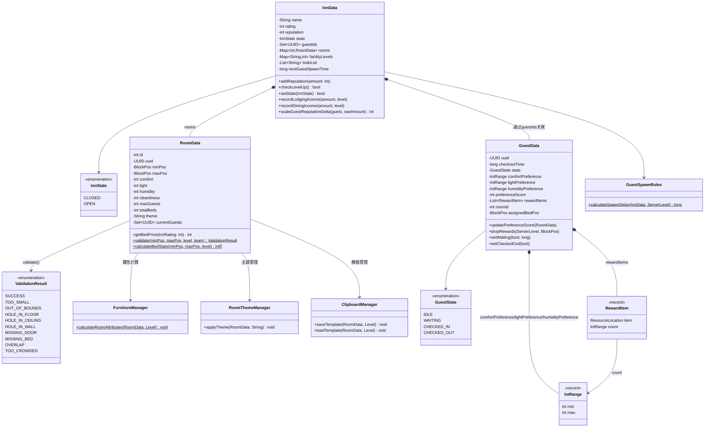
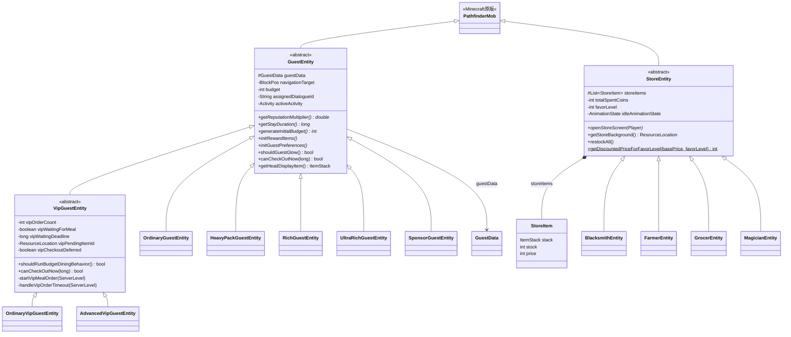
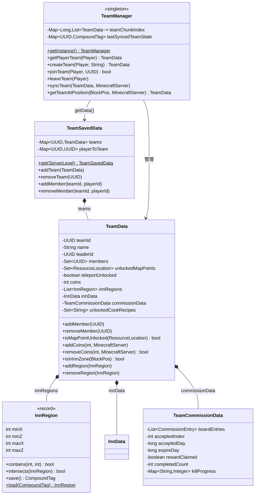
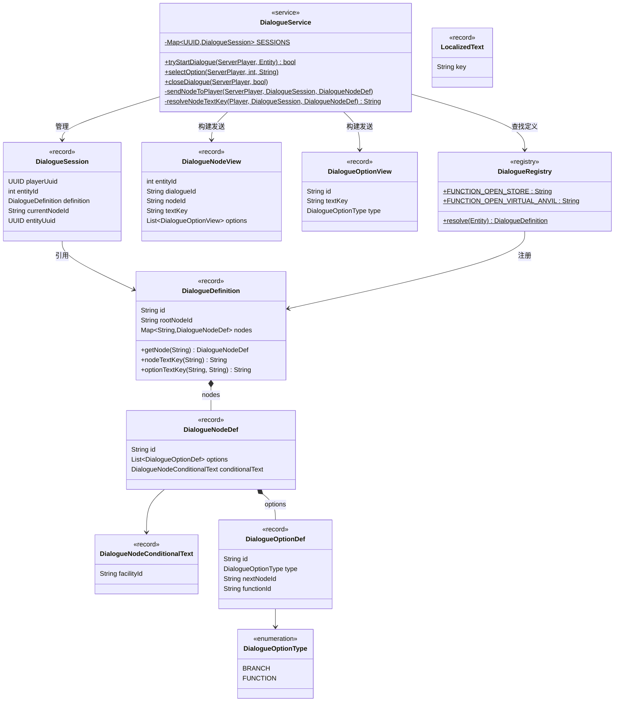
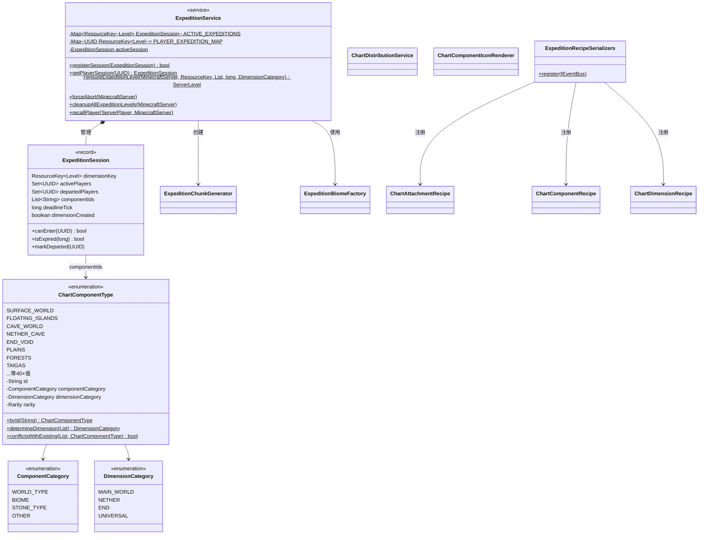
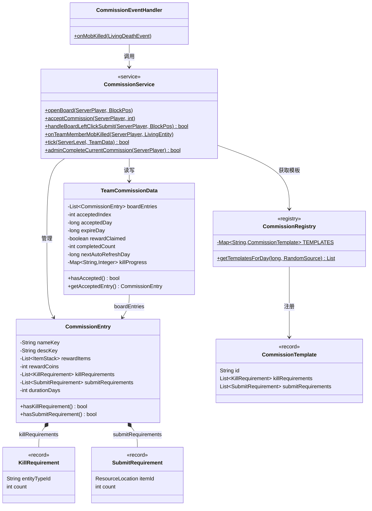
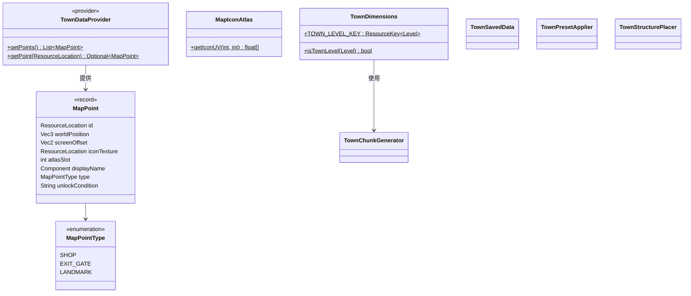
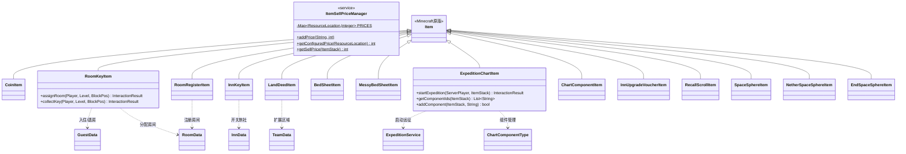

# OtherworldInn 项目分析文档

## 一、项目概述

OtherworldInn 是一个基于 Minecraft NeoForge 1.21.1 的模组，核心主题是**异世界旅社经营**。玩家在专属城镇维度中经营旅社，管理房间、接待旅客、经营商店、完成委托、进行远征探险，并通过声望和收入升级旅社星级。

---

## 二、模块划分与功能分析

### 1. 核心入口与注册模块 (`OtherworldInn`, `foundation`, `init`)

**功能**：模组入口点、配置管理、方块/物品/实体/菜单等资源的注册与数据生成。

| 类/文件 | 类型 | 功能 |
|---------|------|------|
| `OtherworldInn` | 主类 | `@Mod` 入口，注册所有 DeferredRegister，初始化兼容模块 |
| `ClientConfig` | 配置类 | 客户端配置规范 |
| `LootConfig` | 配置类 | 战利品配置 |
| `BlockReg` | 注册辅助 | 方块注册辅助 |
| `ItemReg` | 注册辅助 | 物品注册辅助 |
| `ModBlocks` | 注册器 | 方块 DeferredRegister |
| `ModItems` | 注册器 | 物品 DeferredRegister |
| `ModEntities` | 注册器 | 实体类型 DeferredRegister |
| `ModMenuTypes` | 注册器 | 菜单类型 DeferredRegister |
| `ModCreativeModeTabs` | 注册器 | 创造模式标签页 |
| `ModDimensions` | 注册器 | 维度注册 |
| `ModSounds` | 注册器 | 声音事件注册 |
| `ModLootModifiers` | 注册器 | 战利品修改器注册 |
| `ModGameRules` | 注册器 | 游戏规则注册 |
| `ModColors` | 工具类 | 模组颜色常量 |
| `ModBlockProperties` | 工具类 | 方块属性定义 |
| `DataGenerators` | 数据生成 | 模型/语言/标签/配方等数据生成入口 |
| `ModBlockLootSubProvider` | 数据生成 | 方块战利品表 |
| `ModBlockStateProvider` | 数据生成 | 方块状态模型 |
| `ModItemModelProvider` | 数据生成 | 物品模型 |
| `ModLanguageProvider` | 数据生成 | 语言文件 |
| `ModRecipeProvider` | 数据生成 | 配方 |

---

### 2. 实体模块 (`entity`)

**功能**：定义旅社中的旅客实体和商店NPC实体，是模组最核心的业务模块之一。

#### 2.1 实体基类

| 类 | 类型 | 功能 |
|----|------|------|
| `GuestEntity` | 抽象类 | 旅客实体基类，继承 `PathfinderMob`。管理旅客数据(`GuestData`)、导航目标、预算、偏好、用餐行为、床位交互、退房逻辑。内含 `MoveToTargetGoal`、`SleepInBedGoal`、`WaitAtDeskGoal` 等内部 AI Goal |
| `VipGuestEntity` | 抽象类 | VIP旅客基类，继承 `GuestEntity`。增加点餐系统（VIP客人会点菜，玩家需送餐）、蓝色发光标记、超时声望惩罚、延迟退房机制 |
| `StoreEntity` | 抽象类 | 商店NPC基类，继承 `PathfinderMob`。无AI/无重力/位置锁定/免疫伤害，管理商品列表(`StoreItem`)、好感度系统、每日进货、对话触发、商店界面打开 |

#### 2.2 旅客实体子类

| 类 | 类型 | 功能 |
|----|------|------|
| `OrdinaryGuestEntity` | 具体类 | 普通旅客，基础预算和停留时间 |
| `HeavyPackGuestEntity` | 具体类 | 大包旅客，更高预算 |
| `RichGuestEntity` | 具体类 | 富有旅客，高预算高声望倍率 |
| `UltraRichGuestEntity` | 具体类 | 超级富豪旅客，极高预算 |
| `SponsorGuestEntity` | 具体类 | 赞助商旅客，特殊奖励 |
| `OrdinaryVipGuestEntity` | 具体类 | 普通VIP旅客 |
| `AdvancedVipGuestEntity` | 具体类 | 高级VIP旅客，更复杂的点餐需求 |

#### 2.3 商店NPC子类

| 类 | 类型 | 功能 |
|----|------|------|
| `BlacksmithEntity` | 具体类 | 铁匠NPC，出售矿物/武器/工具类商品 |
| `FarmerEntity` | 具体类 | 农夫NPC，出售农产品类商品 |
| `GrocerEntity` | 具体类 | 杂货商NPC，出售杂货类商品 |
| `MagicianEntity` | 具体类 | 魔法师NPC，出售魔法类商品 |

---

### 3. 旅社数据模块 (`world.inn`)

**功能**：管理旅社核心运营数据——旅社状态、房间、旅客、设施、收入等。

| 类 | 类型 | 功能 |
|----|------|------|
| `InnData` | 数据类 | 旅社核心数据：名称/星级(0-5)/声望/收入统计/状态(OPEN/CLOSED)/旅客列表/房间列表/设施等级/待办事项/旅客生成调度。包含升星判定逻辑、收入日统计、声望缩放 |
| `InnData.InnState` | 枚举 | `CLOSED`, `OPEN` — 旅社营业状态 |
| `GuestData` | 数据类 | 单个旅客数据：UUID/退房时间/状态/偏好(舒适度/光照/湿度)/偏好分数/奖励物品。包含偏好分数计算、奖励物品掉落逻辑 |
| `GuestData.GuestState` | 枚举 | `IDLE`, `WAITING`, `CHECKED_IN`, `CHECKED_OUT` — 旅客生命周期状态 |
| `GuestData.IntRange` | 记录类 | 整数区间，用于偏好范围 |
| `GuestData.RewardItem` | 记录类 | 奖励物品定义(物品ID + 数量范围) |
| `RoomData` | 数据类 | 房间数据：ID/坐标范围/属性(舒适度/光照/湿度/整洁度)/床位数/主题/当前旅客。包含床位价格计算、房间验证逻辑 |
| `RoomData.ValidationResult` | 枚举 | 房间验证结果：`SUCCESS`, `TOO_SMALL`, `OUT_OF_BOUNDS`, `HOLE_IN_FLOOR`, `HOLE_IN_CEILING`, `HOLE_IN_WALL`, `MISSING_DOOR`, `MISSING_BED`, `OVERLAP`, `TOO_CROWDED` |
| `GuestSpawnRules` | 工具类 | 旅客生成规则计算 |
| `ClipboardManager` | 服务类 | 剪贴板管理(房间模板) |
| `FurnitureManager` | 服务类 | 家具管理，计算房间属性(舒适度/光照/湿度) |
| `RoomThemeManager` | 服务类 | 房间主题管理 |
| `InnEventHandler` | 事件处理 | 旅社相关事件处理(旅客生成/退房/日常tick) |
| `FacilityRegistry` | 注册表 | 设施定义注册中心，管理所有可升级设施 |
| `FacilityUpgradeService` | 服务类 | 设施升级业务逻辑 |

#### 设施相关数据结构 (FacilityRegistry 内部)

| 类/记录 | 类型 | 功能 |
|---------|------|------|
| `FacilityDefinition` | 记录类 | 设施定义：ID/名称/最大等级/中心位置/范围/地图点配置/各级别定义 |
| `FacilityLevelDefinition` | 记录类 | 设施等级定义：等级/升级所需物品/金币/结构模板ID |
| `FacilityRange` | 记录类 | 设施范围(相对坐标) |
| `LevelUpgradeCost` | 记录类 | 等级升级消耗(物品列表+金币) |
| `FacilityMapPointConfig` | 记录类 | 设施地图点配置 |

---

### 4. 队伍模块 (`world.team`)

**功能**：管理玩家组队系统，队伍是旅社经营的基本单位。

| 类 | 类型 | 功能 |
|----|------|------|
| `TeamData` | 数据类 | 队伍数据：ID/名称/队长/成员列表/解锁地图点/金币/旅社区域/旅社数据/委托数据/解锁食谱。包含区域管理(添加/删除/差集运算) |
| `TeamData.InnRegion` | 记录类 | 旅社区域(矩形范围)，支持包含/相交/差集运算 |
| `TeamSavedData` | 持久化 | 队伍数据的 `SavedData` 实现，负责NBT序列化和世界级持久化 |
| `TeamManager` | 单例服务 | 队伍管理器：创建/加入/离开队伍、玩家-队伍映射、区块索引(快速查找某区块所属队伍)、增量同步(仅变化时发送网络包) |

---

### 5. 对话模块 (`world.dialogue`)

**功能**：NPC对话系统，支持分支对话和功能触发。

| 类 | 类型 | 功能 |
|----|------|------|
| `DialogueService` | 服务类 | 对话核心服务：启动对话/选择选项/关闭对话/距离检测/会话管理 |
| `DialogueDefinition` | 记录类 | 对话定义：ID/根节点ID/节点映射 |
| `DialogueNodeDef` | 记录类 | 对话节点定义：ID/选项列表/条件文本 |
| `DialogueNodeConditionalText` | 记录类 | 条件文本(根据设施等级显示不同文本) |
| `DialogueNodeView` | 记录类 | 对话节点视图(发送给客户端) |
| `DialogueOptionDef` | 记录类 | 对话选项定义：ID/类型/下一节点ID/功能ID |
| `DialogueOptionView` | 记录类 | 对话选项视图(发送给客户端) |
| `DialogueOptionType` | 枚举 | `BRANCH`(分支跳转), `FUNCTION`(触发功能) |
| `DialogueRegistry` | 注册表 | 对话定义注册中心(44KB，大量对话定义) |
| `LocalizedText` | 记录类 | 本地化文本键 |

---

### 6. 远征模块 (`world.expedition`)

**功能**：远征探险系统——玩家使用探险图表前往临时维度进行探索，维度根据图表组件动态生成。

| 类 | 类型 | 功能 |
|----|------|------|
| `ExpeditionService` | 静态服务 | 远征核心服务：会话管理/维度创建与销毁/玩家传送/模板维度复用/Unsafe偏移量注入ChunkMap |
| `ExpeditionSession` | 记录类 | 远征会话：维度Key/参与玩家/已离开玩家/组件ID/截止时间 |
| `ExpeditionDimensions` | 工具类 | 远征维度相关常量 |
| `ExpeditionChunkGenerator` | 类 | 远征区块生成器 |
| `ExpeditionBiomeFactory` | 工厂类 | 根据组件ID创建生物群系和噪声生成器 |
| `ExpeditionNbtHelper` | 工具类 | 远征NBT序列化辅助 |
| `ChartComponentType` | 枚举 | 图表组件类型(485行)，定义了世界类型/生物群系/岩石类型/其他四大类组件 |
| `ChartComponentType.ComponentCategory` | 枚举 | `WORLD_TYPE`, `BIOME`, `STONE_TYPE`, `OTHER` |
| `ChartComponentType.DimensionCategory` | 枚举 | `MAIN_WORLD`, `NETHER`, `END`, `UNIVERSAL` |
| `ChartDistributionService` | 服务类 | 图表分发逻辑 |
| `ChartComponentIconRenderer` | 渲染器 | 图表组件图标渲染 |

#### 远征配方

| 类 | 类型 | 功能 |
|----|------|------|
| `ChartAttachmentRecipe` | 配方类 | 图表附件合成配方 |
| `ChartComponentRecipe` | 配方类 | 图表组件合成配方 |
| `ChartDimensionRecipe` | 配方类 | 图表维度合成配方 |
| `ExpeditionRecipeSerializers` | 注册器 | 远征配方序列化器注册 |

---

### 7. 委托模块 (`world.commission`)

**功能**：城镇委托板系统——队伍可以接取和完成委托任务获取奖励。

| 类 | 类型 | 功能 |
|----|------|------|
| `CommissionService` | 静态服务 | 委托核心服务：打开委托板/接取委托/提交委托/击杀进度/自动刷新/过期处理/奖励发放 |
| `CommissionEntry` | 数据类 | 委托条目：名称/描述/奖励/击杀需求/提交需求/持续天数 |
| `CommissionEntry.KillRequirement` | 记录类 | 击杀需求(实体类型ID + 数量) |
| `CommissionEntry.SubmitRequirement` | 记录类 | 提交需求(物品 + 数量) |
| `CommissionRegistry` | 注册表 | 委托模板注册中心 |
| `CommissionRegistry.CommissionTemplate` | 记录类 | 委托模板 |
| `TeamCommissionData` | 数据类 | 队伍委托数据：委托板条目/已接取索引/完成数/击杀进度 |
| `CommissionEventHandler` | 事件处理 | 委托相关事件处理 |

---

### 8. 经济模块 (`world.economy`)

**功能**：物品售价管理和金币系统。

| 类 | 类型 | 功能 |
|----|------|------|
| `ItemSellPriceManager` | 静态服务 | 物品售价管理器，静态Map存储所有可售物品价格(原版食物/森罗厨房菜肴/森罗酒馆饮品)，支持动态注册 |

---

### 9. 地图与城镇模块 (`world.map`, `world.dimension`)

**功能**：城镇地图POI系统和维度管理。

| 类 | 类型 | 功能 |
|----|------|------|
| `MapPoint` | 记录类 | 地图点数据：ID/世界坐标/屏幕偏移/图标纹理/图集槽位/名称/类型/解锁条件 |
| `MapPoint.MapPointType` | 枚举 | `SHOP`(商店), `EXIT_GATE`(出口), `LANDMARK`(地标) |
| `TownDataProvider` | 提供者 | 城镇数据提供(地图点列表) |
| `MapIconAtlas` | 工具类 | 地图图标图集管理 |
| `TownDimensions` | 工具类 | 城镇维度相关常量和工具方法 |
| `TownChunkGenerator` | 生成器 | 城镇区块生成器 |
| `TownSavedData` | 持久化 | 城镇数据持久化 |
| `TownPresetApplier` | 工具类 | 城镇预设应用 |
| `TownStructurePlacer` | 工具类 | 城镇结构放置 |

---

### 10. 物品模块 (`item`)

**功能**：模组自定义物品，涵盖旅社经营的各个方面。

| 类 | 类型 | 功能 |
|----|------|------|
| `CoinItem` | 物品类 | 金币物品 |
| `RoomKeyItem` | 物品类 | 房间钥匙——分配/回收房间、旅客入住/退房 |
| `InnKeyItem` | 物品类 | 旅社钥匙——旅社开关门 |
| `RoomRegisterItem` | 物品类 | 房间登记簿——注册新房间 |
| `LandDeedItem` | 物品类 | 地契——扩展旅社区域 |
| `BedSheetItem` | 物品类 | 床单——铺床 |
| `MessyBedSheetItem` | 物品类 | 脏床单——需要清洗 |
| `ExpeditionChartItem` | 物品类 | 远征图表——核心远征物品，管理图表组件、启动远征 |
| `ChartComponentItem` | 物品类 | 图表组件物品 |
| `InnUpgradeVoucherItem` | 物品类 | 旅社升级券 |
| `RecallScrollItem` | 物品类 | 回城卷轴——从远征维度返回 |
| `SpaceSphereItem` | 物品类 | 空间球(主世界) |
| `NetherSpaceSphereItem` | 物品类 | 下界空间球 |
| `EndSpaceSphereItem` | 物品类 | 末地空间球 |

---

### 11. 网络通信模块 (`network`)

**功能**：客户端-服务端网络包通信。

| 类 | 类型 | 方向 | 功能 |
|----|------|------|------|
| `ModMessages` | 注册器 | — | 网络频道注册 |
| `C2SAcceptCommissionPacket` | 数据包 | C→S | 接取委托 |
| `C2SDialogueClosePacket` | 数据包 | C→S | 关闭对话 |
| `C2SDialogueOptionPacket` | 数据包 | C→S | 选择对话选项 |
| `C2SExpeditionCancelPacket` | 数据包 | C→S | 取消远征 |
| `C2SMapModeSyncPacket` | 数据包 | C→S | 地图模式同步 |
| `C2SStorePurchasePacket` | 数据包 | C→S | 商店购买 |
| `C2STeleportPacket` | 数据包 | C→S | 传送请求 |
| `C2SWithdrawCoinPacket` | 数据包 | C→S | 提取金币 |
| `S2CCommissionBoardPacket` | 数据包 | S→C | 委托板数据 |
| `S2CDialogueClosePacket` | 数据包 | S→C | 关闭对话通知 |
| `S2CDialogueNodePacket` | 数据包 | S→C | 对话节点数据 |
| `S2CExpeditionTimerPacket` | 数据包 | S→C | 远征计时器 |
| `S2CTeamSyncPacket` | 数据包 | S→C | 队伍数据同步 |

---

### 12. 客户端模块 (`client`)

**功能**：客户端渲染、GUI界面、覆盖层、相机控制等。

| 类/文件 | 类型 | 功能 |
|---------|------|------|
| `MapViewScreen` | 屏幕 | 地图视图界面(31.6KB，核心UI) |
| `CommissionBoardScreen` | 屏幕 | 委托板界面 |
| `NpcDialogueScreen` | 屏幕 | NPC对话界面 |
| `StoreScreen` | 屏幕 | 商店界面(44.1KB，最大UI文件) |
| `BedSheetOverlay` | 覆盖层 | 床单HUD |
| `CommissionBoardOverlay` | 覆盖层 | 委托板HUD |
| `ExpeditionChartOverlay` | 覆盖层 | 远征图表HUD |
| `ExpeditionTimerOverlay` | 覆盖层 | 远征计时器HUD |
| `FacilityUpgradeOverlay` | 覆盖层 | 设施升级HUD |
| `GuestEntityTooltipOverlay` | 覆盖层 | 旅客实体提示(26.9KB) |
| `InnKeyOverlay` | 覆盖层 | 旅社钥匙HUD |
| `InventoryTeamOverlay` | 覆盖层 | 队伍物品栏HUD |
| `ItemHudOverlay` | 覆盖层 | 物品HUD |
| `LandDeedOverlay` | 覆盖层 | 地契HUD |
| `RoomKeyOverlay` | 覆盖层 | 房间钥匙HUD |
| `RoomRegisterOverlay` | 覆盖层 | 房间登记HUD |
| `CameraHandler` | 控制器 | 相机控制(地图模式) |
| `MapViewVisualEffects` | 控制器 | 地图视图视觉特效 |
| `MapPageManager` | 管理器 | 地图页面管理 |
| `GuestRenderer` | 渲染器 | 旅客实体渲染器 |
| `InnRenderer` | 渲染器 | 旅社渲染器(房间轮廓等) |
| `RoomOutlineRenderer` | 渲染器 | 房间轮廓渲染(15.7KB) |
| `BlacksmithRenderer/Model/Animation` | 渲染器 | 铁匠NPC渲染/模型/动画 |
| `FarmerRenderer/Model` | 渲染器 | 农夫NPC渲染/模型 |
| `GrocerRenderer/Model` | 渲染器 | 杂货商NPC渲染/模型 |
| `MagicianRenderer/Model/Animation` | 渲染器 | 魔法师NPC渲染/模型/动画 |
| `StoreHumanoidModel` | 模型 | 商店NPC通用模型基类 |
| `DeskBellIconRenderer` | 渲染器 | 桌铃图标渲染 |
| `DisplayPriceRenderer` | 渲染器 | 价格显示渲染 |
| `SlotIconRenderer` | 渲染器 | 槽位图标渲染 |

---

### 13. 兼容模块 (`compat`)

**功能**：与其他模组的兼容性集成。

| 类 | 类型 | 兼容模组 | 功能 |
|----|------|----------|------|
| `CreateCompat` | 兼容类 | Create | 机械动力兼容(桌面铃等) |
| `KaleidoscopeCompat` | 兼容类 | Kaleidoscope | 森罗厨房/酒馆兼容 |
| `LittleMaidCompat` | 兼容类 | LittleMaid | 小女仆兼容 |
| `ReskillableCompat` | 兼容类 | Reskillable | 技能等级兼容 |
| `ReskillableSkillXpHandler` | 处理器 | Reskillable | 技能经验处理 |
| `FixedXpCurve` | 工具类 | Reskillable | 固定经验曲线 |
| `FrontDeskTask` | 任务 | LittleMaid | 前台任务 |
| `RoomCleanTask` | 任务 | LittleMaid | 房间清洁任务 |
| `FTBUltimineConfigState` | 状态 | FTBUltimine | 矿脉挖掘配置状态 |
| `NpcStoreJeiCategory` | JEI | JEI | NPC商店JEI分类 |
| `NpcStoreJeiData` | JEI | JEI | NPC商店JEI数据 |
| `NpcStoreJeiPlugin` | JEI | JEI | NPC商店JEI插件 |
| `NpcStoreJeiRecipe` | JEI | JEI | NPC商店JEI配方 |

---

### 14. Mixin模块 (`mixin`)

**功能**：通过Mixin注入修改原版和其他模组的行为。

| 类 | 修改目标 | 功能 |
|----|----------|------|
| `MixinBedBlock` | 原版床方块 | 修改床的交互逻辑 |
| `BedBlockExtension` | 床方块扩展 | 接口扩展 |
| `MixinBaseFireBlockTownPortal` | 火焰方块 | 城镇传送门火焰逻辑 |
| `MixinBushBlockTownDecorSurvival` | 灌木方块 | 城镇装饰生存模式处理 |
| `MixinCoralBlock/FanBlock/WallFanBlock` | 珊瑚方块 | 珊瑚死亡处理 |
| `MixinCropBlockTownDecorSurvival` | 作物方块 | 城镇作物生存模式处理 |
| `MixinContraption` | Create装置 | 修改机械装置行为 |
| `MixinDepotRenderer` | Create仓库渲染 | 修改仓库渲染 |
| `MixinDeskBellBlockEntity/Renderer` | Create桌面铃 | 修改桌面铃逻辑/渲染 |
| `MixinFanProcessing` | Create风扇处理 | 修改风扇加工逻辑 |
| `MixinFoodDataNaturalRegenRate` | 原版食物数据 | 修改自然恢复速率 |
| `MixinPlayerExhaustionRate` | 原版玩家 | 修改饥饿消耗速率 |
| `MixinPlayerExperience` | 原版玩家 | 修改经验获取 |
| `MixinNeutralMobAnger` | 原版中立生物 | 修改中立生物愤怒机制 |
| `MixinSeasonalCropGrowthHandler` | 季节模组 | 修改季节作物生长 |
| `MixinStructurePlacement` | 原版结构放置 | 修改结构放置逻辑 |
| `MixinServerLevel` | 原版服务端Level | 修改服务端Level行为 |
| `MixinMinecraftServerLevelsAccessor` | 原版MinecraftServer | 访问器，获取levels Map |
| `MixinMinecraftServerSave` | 原版MinecraftServer | 修改保存逻辑 |
| `MixinEntityRenderDispatcherMapMode` | 原版渲染调度 | 地图模式下隐藏玩家渲染 |
| `MixinPlayerRendererMapModeHidden` | 原版玩家渲染 | 地图模式隐藏玩家 |
| `MixinRecipeItemUnlock` | 食谱物品 | 食谱解锁逻辑 |
| `MixinPotBlockEntityCookCheck/StockpotCheck` | 森罗厨房 | 锅/瓦罐烹饪检查 |
| `MixinReskillable*` | Reskillable | 多个技能系统Mixin |
| `MixinLittleMaidFarmMoveTask/TaskNormalFarm` | LittleMaid | 小女仆农场任务 |
| `MixinFTBUltimineServerConfig` | FTBUltimine | 矿脉挖掘服务端配置 |
| `MixinTransportedItemStack` | Create | 修改运输物品栈 |

---

### 15. 事件与保护模块 (`world.event`)

**功能**：城镇内的事件处理和区域保护。

| 类 | 类型 | 功能 |
|----|------|------|
| `TownProtectionHandler` | 事件处理 | 城镇区域保护(29.1KB，核心保护逻辑) |
| `PlayerEventHandler` | 事件处理 | 玩家事件处理(加入/离开/维度切换) |
| `FacilityInteractionHandler` | 事件处理 | 设施交互处理 |
| `ExpeditionEventHandler` | 事件处理 | 远征事件处理 |
| `ExpeditionInputHandler` | 事件处理 | 远征输入处理 |
| `TownNaturalMobSpawnBlocker` | 事件处理 | 城镇自然生物生成阻止 |
| `DisappearManager` | 运行时 | 实体消失管理 |
| `ExhaustionRegenBridge` | 运行时 | 饥饿恢复桥接 |

---

### 16. 其他模块

| 模块 | 类 | 功能 |
|------|-----|------|
| 传送 (`world.teleport`) | `TeleportUtils` | 传送工具方法 |
| 投射物 (`world.entity.projectile`) | `CoinProjectileEntity` | 金币投射物实体 |
| 战利品 (`world.loot`) | `ChartComponentLootModifier` | 图表组件战利品修改器 |
| 背包 (`world.inventory`) | `StoreMenu`, `CommissionBoardMenu` | 商店菜单、委托板菜单 |
| 方块 (`block`) | `CommissionBoardBlock` | 委托板方块 |
| 命令 (`command`) | `AdminCommands`, `ExpeditionCommands`, `TeamCommands` | 管理员/远征/队伍命令 |
| 工具 (`util`) | `AdvancementUtils`, `BlockEntitySearchUtils`, `EntityUtils`, `TextureUtils` | 进度/方块实体搜索/实体/纹理工具 |
| 服务 (`util.service`) | `GuestNameManager`, `MojangProfileService`, `SponsorNamePool` | 旅客名称/Mojang档案/赞助者名称管理 |

---

## 三、枚举汇总

| 枚举 | 所属模块 | 值 | 功能 |
|------|----------|-----|------|
| `InnState` | 旅社数据 | `CLOSED`, `OPEN` | 旅社营业状态 |
| `GuestState` | 旅客数据 | `IDLE`, `WAITING`, `CHECKED_IN`, `CHECKED_OUT` | 旅客生命周期 |
| `ValidationResult` | 房间数据 | `SUCCESS`, `TOO_SMALL`, `OUT_OF_BOUNDS`, `HOLE_IN_FLOOR`, `HOLE_IN_CEILING`, `HOLE_IN_WALL`, `MISSING_DOOR`, `MISSING_BED`, `OVERLAP`, `TOO_CROWDED` | 房间验证结果 |
| `DialogueOptionType` | 对话 | `BRANCH`, `FUNCTION` | 对话选项类型 |
| `MapPointType` | 地图 | `SHOP`, `EXIT_GATE`, `LANDMARK` | 地图点类型 |
| `ChartComponentType` | 远征 | (40+值) | 图表组件类型(世界类型/生物群系/岩石/其他) |
| `ComponentCategory` | 远征 | `WORLD_TYPE`, `BIOME`, `STONE_TYPE`, `OTHER` | 组件分类 |
| `DimensionCategory` | 远征 | `MAIN_WORLD`, `NETHER`, `END`, `UNIVERSAL` | 维度分类 |

---

## 四、UML 类图（按功能模块）

### 4.1 旅社经营模块



### 4.2 实体模块



### 4.3 队伍模块



### 4.4 对话模块



### 4.5 远征模块



### 4.6 委托模块



### 4.7 地图与城镇模块



### 4.8 经济与物品模块



### 4.9 网络通信模块

```mermaid
classDiagram
    class ModMessages {
        <<registry>>
        +CHANNEL : SimpleChannel$
        +register()$
        +sendToPlayer(Packet, ServerPlayer)$
        +sendToServer(Packet)$
    }

    class C2SAcceptCommissionPacket {
        +int index
    }
    class C2SDialogueClosePacket
    class C2SDialogueOptionPacket {
        +int entityId
        +String optionId
    }
    class C2SExpeditionCancelPacket
    class C2SMapModeSyncPacket {
        +boolean mapMode
    }
    class C2SStorePurchasePacket {
        +int entityId
        +int slotIndex
        +int quantity
    }
    class C2STeleportPacket {
        +ResourceLocation pointId
    }
    class C2SWithdrawCoinPacket {
        +int amount
    }
    class S2CCommissionBoardPacket {
        +CompoundTag boardData
        +boolean isOpen
    }
    class S2CDialogueClosePacket
    class S2CDialogueNodePacket {
        +DialogueNodeView nodeView
    }
    class S2CExpeditionTimerPacket {
        +long deadlineTick
    }
    class S2CTeamSyncPacket {
        +CompoundTag teamData
    }

    ModMessages --> C2SAcceptCommissionPacket : 注册
    ModMessages --> C2SDialogueClosePacket : 注册
    ModMessages --> C2SDialogueOptionPacket : 注册
    ModMessages --> C2SExpeditionCancelPacket : 注册
    ModMessages --> C2SMapModeSyncPacket : 注册
    ModMessages --> C2SStorePurchasePacket : 注册
    ModMessages --> C2STeleportPacket : 注册
    ModMessages --> C2SWithdrawCoinPacket : 注册
    ModMessages --> S2CCommissionBoardPacket : 注册
    ModMessages --> S2CDialogueClosePacket : 注册
    ModMessages --> S2CDialogueNodePacket : 注册
    ModMessages --> S2CExpeditionTimerPacket : 注册
    ModMessages --> S2CTeamSyncPacket : 注册
```



### 4.10 客户端模块

```mermaid
classDiagram
    class Screen {
        <<Minecraft原版>>
    }

    class MapViewScreen {
        -MapPageManager pageManager
        +render(GuiGraphics, int, int, float)
    }
    class CommissionBoardScreen
    class NpcDialogueScreen
    class StoreScreen

    class Overlay {
        <<接口>>
    }

    class BedSheetOverlay
    class CommissionBoardOverlay
    class ExpeditionChartOverlay
    class ExpeditionTimerOverlay
    class FacilityUpgradeOverlay
    class GuestEntityTooltipOverlay
    class InnKeyOverlay
    class InventoryTeamOverlay
    class ItemHudOverlay
    class LandDeedOverlay
    class RoomKeyOverlay
    class RoomRegisterOverlay

    class CameraHandler
    class MapViewVisualEffects
    class MapPageManager

    class GuestRenderer
    class InnRenderer
    class RoomOutlineRenderer
    class BlacksmithRenderer
    class BlacksmithModel
    class BlacksmithAnimation
    class FarmerRenderer
    class FarmerModel
    class GrocerRenderer
    class GrocerModel
    class MagicianRenderer
    class MagicianModel
    class MagicianAnimation
    class StoreHumanoidModel
    class DeskBellIconRenderer
    class DisplayPriceRenderer

    Screen <|-- MapViewScreen
    Screen <|-- CommissionBoardScreen
    Screen <|-- NpcDialogueScreen
    Screen <|-- StoreScreen
    MapViewScreen --> MapPageManager
    MapViewScreen --> CameraHandler
    MapViewScreen --> MapViewVisualEffects

    GuestRenderer ..> GuestEntity : 渲染
    BlacksmithRenderer --> BlacksmithModel
    BlacksmithRenderer --> BlacksmithAnimation
    BlacksmithModel --> StoreHumanoidModel
    FarmerRenderer --> FarmerModel
    FarmerModel --> StoreHumanoidModel
    GrocerRenderer --> GrocerModel
    GrocerModel --> StoreHumanoidModel
    MagicianRenderer --> MagicianModel
    MagicianRenderer --> MagicianAnimation
    MagicianModel --> StoreHumanoidModel
```



---

## 五、跨模块联动描述

### 5.1 旅客入住流程（实体模块 ↔ 旅社数据模块 ↔ 队伍模块）

1. `InnEventHandler` 在 tick 中检查 `InnData.nextGuestSpawnTime`，到时间后调用 `GuestSpawnRules` 计算生成参数
2. 生成 `GuestEntity` 子类实体，调用 `GuestData.setWaiting()` 进入 `WAITING` 状态
3. 玩家使用 `RoomKeyItem` 右键旅客，调用 `InnData.assignRoom()` → `RoomData.addGuest()` → `GuestData.setRoomId()` 状态变为 `CHECKED_IN`
4. 退房时 `GuestEntity` 检测 `GuestData.checkoutTime` 到期，调用 `InnData.checkOutGuest()` → `GuestData.dropRewards()` → `TeamData.addCoins()`

### 5.2 VIP点餐流程（实体模块 ↔ 经济模块 ↔ 队伍模块）

1. `VipGuestEntity.tick()` 中触发 `startVipMealOrder()`，随机选择食物并设置等待状态
2. 玩家手持正确食物右键VIP旅客，`VipGuestEntity.mobInteract()` 验证食物
3. 通过 `ItemSellPriceManager.getConfiguredPrice()` 计算价格，双倍支付给 `TeamData.addCoins()`
4. `InnData.addReputation()` 增加声望，`TeamManager.syncTeam()` 同步数据

### 5.3 商店购买流程（实体模块 ↔ 对话模块 ↔ 网络模块）

1. 玩家右键 `StoreEntity`，先尝试 `DialogueService.tryStartDialogue()`
2. 对话中选择"打开商店"选项（`DialogueOptionType.FUNCTION`），触发 `StoreEntity.openStoreForPlayer()`
3. 客户端打开 `StoreScreen`，购买时发送 `C2SStorePurchasePacket`
4. 服务端处理购买逻辑，扣除金币、减少库存、增加好感度

### 5.4 远征流程（远征模块 ↔ 队伍模块 ↔ 网络模块）

1. 玩家使用 `ExpeditionChartItem`，选择组件组合后启动远征
2. `ExpeditionService.ensureExpeditionLevel()` 动态创建临时维度（基于 `ChartComponentType` 组合）
3. `ExpeditionService.registerSession()` 注册会话，传送玩家
4. 客户端通过 `S2CExpeditionTimerPacket` 显示倒计时
5. 远征结束或玩家使用 `RecallScrollItem` 返回，`ExpeditionService` 清理临时维度

### 5.5 委托流程（委托模块 ↔ 队伍模块 ↔ 网络模块）

1. 玩家右键 `CommissionBoardBlock`，`CommissionService.openBoard()` 发送 `S2CCommissionBoardPacket`
2. 客户端显示 `CommissionBoardScreen`，接取时发送 `C2SAcceptCommissionPacket`
3. 击杀怪物时 `CommissionEventHandler` 通知 `CommissionService.onTeamMemberMobKilled()`
4. 完成后奖励通过 `TeamData.addCoins()` 发放，`TeamManager.syncTeam()` 同步

### 5.6 设施升级流程（旅社数据模块 ↔ 队伍模块 ↔ 城镇模块）

1. 玩家使用升级模板物品，`FacilityInteractionHandler` 检测交互
2. `FacilityUpgradeService` 验证升级条件（物品+金币）
3. 升级成功后 `InnData.facilityLevels` 更新，`TownStructurePlacer` 放置新结构
4. `TeamManager.syncTeam()` 同步数据

### 5.7 队伍数据同步流程（队伍模块 ↔ 网络模块）

1. 任何修改 `TeamData` 的操作后调用 `TeamManager.syncTeam()`
2. `TeamManager` 使用增量同步机制，比较 NBT 差异，仅变化时发送 `S2CTeamSyncPacket`
3. 客户端收到后更新本地缓存，`TeamManager.getClientPlayerTeam()` 返回缓存数据

---

## 六、全局UML类图（跨模块关联）

```mermaid
classDiagram
    direction TB

    class TeamData {
        -UUID teamId
        -int coins
        -InnData innData
        -TeamCommissionData commissionData
        -Set~UUID~ members
        -List~InnRegion~ innRegions
    }

    class InnData {
        -int rating
        -int reputation
        -InnState state
        -Map~int,RoomData~ rooms
        -Set~UUID~ guestIds
        -Map~String,int~ facilityLevels
    }

    class RoomData {
        -int id
        -BlockPos minPos maxPos
        -int comfort light humidity
        -int cleanliness
        -Set~UUID~ currentGuests
    }

    class GuestData {
        -UUID uuid
        -GuestState state
        -int roomId
        -IntRange comfortPreference
        -int preferenceScore
    }

    class GuestEntity {
        <<abstract>>
        +GuestData guestData
        +getReputationMultiplier() double*
    }

    class VipGuestEntity {
        <<abstract>>
        -boolean vipWaitingForMeal
        -ResourceLocation vipPendingItemId
    }

    class StoreEntity {
        <<abstract>>
        -List~StoreItem~ storeItems
        -int favorLevel
    }

    class TeamManager {
        <<singleton>>
        +getInstance() TeamManager$
        +getPlayerTeam(Player) TeamData
        +syncTeam(TeamData, MinecraftServer)
    }

    class TeamSavedData {
        -Map~UUID,TeamData~ teams
        -Map~UUID,UUID~ playerToTeam
    }

    class DialogueService {
        +tryStartDialogue(ServerPlayer, Entity) bool$
        +selectOption(ServerPlayer, int, String)$
    }

    class DialogueRegistry {
        +resolve(Entity) DialogueDefinition$
    }

    class CommissionService {
        +openBoard(ServerPlayer, BlockPos)$
        +acceptCommission(ServerPlayer, int)$
        +tick(ServerLevel, TeamData) bool$
    }

    class ExpeditionService {
        +ensureExpeditionLevel(...) ServerLevel$
        +registerSession(ExpeditionSession) bool$
        +recallPlayer(ServerPlayer, MinecraftServer)$
    }

    class ExpeditionSession {
        ResourceKey~Level~ dimensionKey
        Set~UUID~ activePlayers
        List~String~ componentIds
        long deadlineTick
    }

    class ItemSellPriceManager {
        +getConfiguredPrice(ResourceLocation) int$
        +getSellPrice(ItemStack) int$
    }

    class FacilityUpgradeService {
        +tryUpgrade(TeamData, String, ServerLevel) bool
    }

    class FacilityRegistry {
        +getFacility(String) FacilityDefinition$
    }

    class InnEventHandler {
        +onServerTick(ServerTickEvent)$
    }

    class TownProtectionHandler {
        +onBlockBreak(BlockEvent)$
        +onBlockPlace(BlockEvent)$
    }

    class ModMessages {
        +sendToPlayer(Packet, ServerPlayer)$
        +sendToServer(Packet)$
    }

    TeamData *-- InnData : innData
    TeamData *-- TeamCommissionData : commissionData
    InnData *-- RoomData : rooms
    GuestEntity *-- GuestData : guestData
    GuestEntity <|-- VipGuestEntity
    StoreEntity ..> DialogueService : 触发对话
    DialogueService ..> DialogueRegistry : 查找定义
    VipGuestEntity ..> ItemSellPriceManager : 计算餐费
    VipGuestEntity ..> TeamData : addCoins
    GuestEntity ..> InnData : 入住/退房
    GuestEntity ..> RoomData : 分配房间
    RoomData ..> GuestData : 关联旅客
    TeamManager *-- TeamSavedData : 持久化
    TeamManager --> TeamData : 管理/同步
    TeamManager ..> ModMessages : 发送S2CTeamSyncPacket
    CommissionService ..> TeamData : 读写委托数据
    CommissionService ..> TeamManager : syncTeam
    ExpeditionService *-- ExpeditionSession : 管理
    ExpeditionService ..> TeamData : 检查队伍
    FacilityUpgradeService ..> FacilityRegistry : 获取定义
    FacilityUpgradeService ..> InnData : 更新设施等级
    FacilityUpgradeService ..> TeamData : 扣除金币
    InnEventHandler ..> InnData : tick生成旅客
    InnEventHandler ..> GuestEntity : 生成实体
    TownProtectionHandler ..> TeamManager : 检查区域
    InnData ..> GuestData : 管理旅客
    StoreEntity ..> TeamData : 好感度关联
